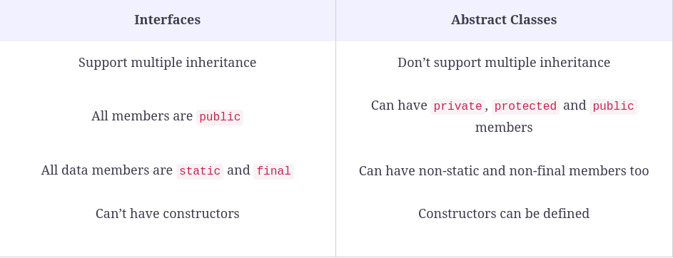

## Tìm hiểu tính trừu tượng trong lập trình OOP (abstract class, interface)
- Định nghĩa: chỉ hiển thị những tính năng cần thiết cho người dùng, ẩn đi chi tiết triển khai bên trong để giảm độ phức tạp.
Người dùng chỉ cần biết đối tượng làm gì, không cần biết nó hoạt động như thế nào.
- Kiểu dữ liệu trừu tượng (class): chỉ định nghĩa những hoạt động nào được thực hiện, không chi tiết nó được thực hiện như thế nào
- Java làm thế nào: sử dụng Abstract Class và Interface
- Sử dụng keyword abstract cho method và cho class.


- Abstract method: chỉ được khai báo bên trong abstract class hoặc interface
  + Method không có body 
  + Không được khai báo private vì nó được triển khai bên trong class khác
  + Cách khai báo:
  ```java 
    public abstract void methodName(parameter(s));
  ```
  
- Abstract class:
  + Không thể tạo 1 object
  + Chứa cả abstract method và method bình thường
  + Để sử dụng cần kế thừa nó (học từ bài trước)
  + Class kế thừa từ abstract class cần triển khai tất cả các abstract method ở class cha.
  + Giống class bình thường, có: constructor, biến static, methods.
  + Khai báo:
  ```java
  abstract class ClassName {
  
  // Implementation here

  }
  ``` 
- Interface:
  + Nó cũng giống như 1 class nhưng nó xác định những hành vi mà class cần phải thực hiện.
  + interface có thể được sử dụng để đạt được 100% tính trừu tượng của OOP. (chỉ chứa các abstract method)
  + interface có thể coi như 1 hợp đồng, mọi class triển khai phải chi tiết tất cả các hành vi trong hợp đồng đó.
  + Khai báo:
  ```java
  interface interfaceName {
  
  // Code goes here

  }
  ```
  + interface có thể có:
    * abstract method(s)
    * default method(s)
    * static method(s)
    * private method(s)
    * private static method(s)
    * public static final variable(s)
  + Tất cả các method được khai báo hoặc triển khai trong interface được mặc định là public và tất cả các biến mặc định là public static final
  + Giống như abstract class thì interface không thể tạo đối tượng.
  + Class phải triển khai tất cả những abstract class trong interface.
  + Interface không có constructor
  + 1 class không được kế thừa từ nhiều class nhưng đc implement từ nhiều interface 
  + 1 interface có thể kế thừa từ 1 interface khác
  + 1 interface không được khai báo private hoặc protected
  + Lợi ích:
    * Thể hiện được 100% tính trừu tượng của OOP
    * Tạo ra sự liên kết lỏng lẻo trong ứng dụng (loose coupling). Thay đổi 1 class thì không làm ảnh hưởng đến class khác triển khai nó.
    * Chia nhỏ thiết kế phực tạp và làm rõ ràng những phụ thuộc giữa các đối tượng.
    * Có thể sử dụng trong đa kế thừa.
- Default method trong interface
  + Định nghĩa: trước java 8 thì interface chỉ chứa những abstract method, từ java 8 đã xuất hiện default method, có thể viết code trong body.
  + Trước java 8 thì khi khai 1 abtract class thì tất cả những class implement đều phải triển khai cụ thể method đó, tuy nhiên không phải class nào cũng cần method này
    từ đó defaut method sẽ định nghĩa trong interface như 1 method bình thường có body cụ thể. Class nào cần thì gọi method này để thực thi.
  + Có thể ghi đè nên class nào cần thì ghi đè.
  + Cú pháp:
  ```java
  public interface Vehicle {

    void cleanVehicle();

    default void startVehicle() {
        System.out.println("Vehicle is starting");
    }
  } 
  ```
  + Vấn đề phát sinh: 1 class implement 2 interface có default method giống nhau thì biết dùng cái nào.
  ```java 
  @Override
    public void printSomething() {

        //Cách 1
        System.out.println("I am inside Main class");

        //Cách 2
        InterfaceA.super.printSomething();
        InterfaceB.super.printSomething();
    }

  ```
- Static method trong interface:
  + Giống default method nhưng không ghi đè được:
  ```java 
  public interface Vehicle {

    static void cleanVehicle(){
        System.out.println("I am cleaning vehicle");
    }
  }

  ```
  + Có default method rồi thì có cần static method nữa không? Có. Nếu không muốn class implement ghi đè method.
- Functional interfaces:
  + Là interface chứa 1 abtract method duy nhất.
  + Xem package này của java 8: java.util.function
  + Được sử dụng bởi: lambda expressions
  + Sử dụng annotation: @FunctionalInterface (không bắt buộc, nhưng nếu thêm 1 abtract method thì biên dịch sẽ báo lỗi)
  ```java
  @FunctionalInterface
  public interface Functional {
  void doSomething();
  
      default void foo() {
          System.out.println("foo");
      }
  }

  ```
- Đa kế thừa
- So sánh interface và abstract class
  
